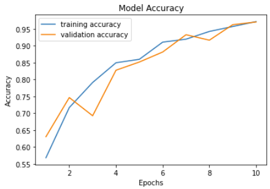
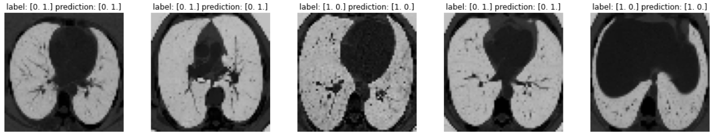
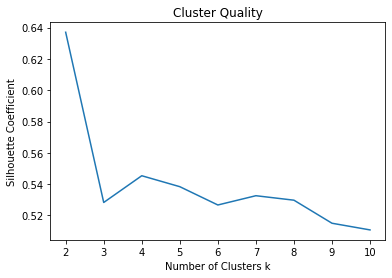
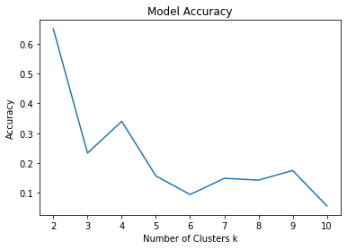
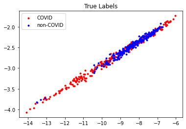
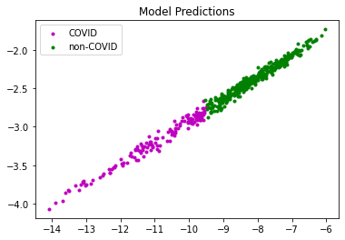

# Covid Identifier for CT Scans: Team 70 Project
## Introduction/Background:
We aim to classify x-ray images of people’s chests to identify which images indicate that one is COVID-19 positive.
 
Through our research, we found that the occurrence of abnormal chest x-rays is highly corresponding to Covid-19 (Rousan et al., 2020). Inspired by the fact that chest imaging is not a first-line test for COVID-19 due to low diagnostic accuracy and confounding with other viral pneumonias, Nikolaou et al. showed that with the aid of machine learning, it is feasible to accurately distinguish COVID-19 from other viral pneumonia and healthy lungs on x-ray pictures (Nikolaou et al., 2021). After determination of the COVID-19 disease course and severity using chest X-ray (CXR) scoring system, Yasin & Gouda showed that Radiographic findings can be utilized to evaluate long-term effects because they are great predictors of the course of the COVID-19 disease (Yasin & Gouda, 2020).

We conclude that chest X-rays are applicable and reliable imaging techniques to identify the coronavirus. With the Chest X-Ray dataset, we aim to develop a Machine Learning Model to classify the X-Rays of Healthy vs. COVID-19 affected patients.
 
## Problem definition: 
The fastest and most effective ways to test Covid-19 are to use PCR and antigen. However, neither of these 2 approaches to covid testing visualize the infection. In this project, the “chest x-ray testing” approach for classifying Covid patients will be investigated if it is an accurate testing procedure with visualization.

## Data Collection:
Our dataset is collected from Kaggle: https://www.kaggle.com/datasets/plameneduardo/sarscov2-ctscan-dataset

These raw data (images) were extracted from a publicly accessible dataset of SARS-CoV-2 CT scans. This dataset includes 2482 CT scans, 1252 of which are COVID positive and 1230 are COVID negative. The data was collected from actual patients who were treated in Sao Paulo, Brazil, hospitals. The dataset contains black and white images of CT Scans of people's chests. With over a thousand images for each label and each image being relatively high in definition, we were provided with a solid foundation for accurate and efficient analysis of machine learning models.

## Methods:
The packages we are going to use are numpy, pandas, and cv2 (OpenCV). Meanwhile, we are using Keras as the interface for TensorFlow. From TensorFlow, we’d like to import Sequential, Conv2D, MaxPooling2D, etc.   
The model is trained by 2 groups of labeled images: Covid and Non-Covid. The model will make classifications on input images.
 
## Results and Discussion:
### Model 1: CNN based on DenseNet121
Densely Connected Convolutional Networks, or DenseNet, is a method to increase the depth of deep convolutional network.  
It simplifies the connectivity pattern between the layers. With the nature of require fewer parameters, DenseNet avoids learning redundant feature map. In our first model, we use DenseNet121, which is a DenseNet model that performs image classification.

#### Preprocessing:
We divided our 2482-image dataset into **train**, **validation**, and **test** subfolders with a ratio of .7:.15:.15 using a package called **split-folders**.
Then, using the `flow_from_directory()` function of ImageDataGenerator from Keras, we resized the images to (64, 64, 3) before passing them into `train_ds` and `val_ds` variables. The data flowed into `train_ds` are shuffled for a possibly better training outcome. The resizing was necessary due to the input size of DenseNet121, which we will further discuss below.

#### Neural Network Details:

#### Training Procedure:
Our Dataset comes in 2 folders/labels–**COVID** and **NON-COVID**. We first split our dataset as mentioned in preprocessing, which randomly assigns images to **train**, **validation**, and **test** subfolders regardless of their label.  
Then, we build our model using DenseNet121 with pretrained weights obtained from ImageNet. Our model is backed by TensorFlow and Keras, and DenseNet121 is directly imported from `keras.applications`. As shown in the graph under Neural Network Details, our model has 7,219,414 trainable parameters. The following are some specifics of our best model.  
`optimizer = Adam(learning_rate=0.001, beta_1=0.9, beta_2=0.999, epsilon=0.1, decay=0.0)`  
`model.compile(loss='categorical_crossentropy', optimizer=optimizer, metrics=['accuracy'])`  
As shown, our loss is calculated using categorical_crossentropy.  
We ran our training for 10 epochs for 50 steps per epoch. We then saved the model with the least validation loss throughout training.

#### Visualization:
  
The number of epochs is positively correlated with accuracy and negatively correlated with loss as expected. Validation accuracy and loss seem to fluctuate a lot more than training accuracy and loss. Our model reaches its highest accuracy of `0.9704` after the last epoch which is also when the validation loss reaches its low at 0.1016. Previous model training seesions tend to produce the best model at epoch 9.

Here are sample predictions by passing in images extracted from our test dataset into our model.

Note that labels `[1,0]` and `[0,1]` represent **COVID** and **NON-COVID** respectively.
Training our model using DenseNet121 with weights pretrained from ImageNet seems viable given the high accuracy in identifying covid. However, whether this is applicable to covid identification in society is yet to be decided.

#### Fine Tuning:
We changed the parameters of the optimizer and repeated the training for 10 epochs each. After the training, we got the following results and compared the validation loss and validation accuracy of each training. (We plot the most optimal result of each training in the following table.)  

| Learning Rate |	Beta_1	| Beta_2	| Epsilon |	Decay |	Epoch#	| Loss |	Accuracy	| Val_loss |	Val_accuracy|
| --- | --- | --- | --- | --- | --- | --- | --- | --- | --- |
| 0.001 |	0.9 |	0.999 |	0.1	| 0 | Epoch10	| 0.0742	| 0.9714 | 0.1016 |	0.9704 |
|0.002 |	0.9	| 0.999 |	0.1 |	0 | Epoch8	| 0.0573	| 0.9794	| 0.1036	| 0.9623 |
|0.005	| 0.9	| 0.999	| 0.1	| 0 | Epoch10	|	0.0722 |	0.9734 |	0.1864 |	0.9461 |
|0.001	| 0.8	| 0.999	| 0.1	| 0 | Epoch10	| 0.098	| 0.9645	| 0.1653	| 0.9461 |
|0.001	| 0.75	| 0.999	| 0.1	| 0 | Epoch10	| 0.0703	| 0.9727	| 0.1543	| 0.9515 |
|0.001	| 0.5	| 0.999	| 0.1	| 0 | Epoch10	| 0.1291	| 0.9499	| 0.184	| 0.9299 |
|0.001	| 0.9	| 0.95	| 0.1	| 0 | Epoch10	| 0.0468	| 0.9835	| 0.1091	| 0.9596 |
|0.001	| 0.9	| 0.9	| 0.1	| 0 | Epoch10	| 0.0647	| 0.9772	|0.1393	| 0.9515 |  

From the table, we noticed that  
a) When the Learning Rate becomes larger, the optimal validation loss will increase and the optimal validation accuracy will decrease.  
b) When Beta_1 becomes smaller, the optimal validation accuracy will decrease, while the validation loss will be larger than the original data.  
c) When Beta_2 becomes smaller, the optimal validation loss will increase and the optimal validation accuracy will decrease.   

We conclude that in order to get optimal results, we need to minimize our learning rate because it can allow the model to learn a more optimal set of weights. We should also keep Beta_1 and Beta_2 as close to 1 as possible since they are multiplied by themselves during training. Besides, we also need to make sure that Beta_1 and Beta_2 are not below 0.5, as it will result in drastic decreases of validation as the number of training steps increases.  

---

### Model 2: Vision Transformer (ViT)

A Vision Transformer (ViT) is a transformer that is designed specifically at vision processing tasks such as image recognition.  

Transformers measure attention—the relationships between pairs of input tokens. For images, the basic unit of analysis is the pixel. ViT computes relationships among pixels in a variety of tiny picture portions at a significantly lower cost.

#### Vision Transformer Overview:

#### Training Procedure:

We first split data using the procedure in preprocessing. Using sklearn.model_selection.train_test_split on the training dataset, we found images belong to 2 classes: COVID and non-COVID. Then, we build our model from vit_base_patch16_224, with Adam as the optimizer. The model details are shown in the graph under Vision Transformer Overview. Fitting the model, we found that as epoch increases, accuracy increases while loss decreases. Applying our model to a few test images, we found all predictions match their corresponding labels.  

#### Results:
  
The number of epochs is roughly positively correlated with accuracy and negatively correlated with loss. Validation accuracy and loss seem to fluctuate a lot more than training accuracy and loss. Meanwhile, the increase in epochs results in a smaller loss. With epochs between 8 and 10, the training accuracy is between 0.88 to 1, with a fair loss. Our validation loss reaches its low at epoch 9, which is where we saved our model. Our model ends up having about 88% validation accuracy.

---

### Model 3: K-Means Clustering
Densely Connected Convolutional Networks, or DenseNet, is a method to increase the depth of deep convolutional network.  
It simplifies the connectivity pattern between the layers. With the nature of require fewer parameters, DenseNet avoids learning redundant feature map. In our first model, we use DenseNet121, which is a DenseNet model that performs image classification.

#### Preprocessing:
We firstly resized all images to (64,64) using `cv2.resize()`. Then, using sklearn's `train_test_split`, We divided our 2482-image dataset into **train** and **validation** with a ratio of .8:.2.  
We then created an encoder of dimension 2. Our encoder lowers the dimentionality of our data and encodes it with a 2-D value of the form `[x,y]`. We train our encoder with our **training** dataset, then fit our **validation** dataset to obtain the encoded validation data.

#### Encoder Details:

#### Training Procedure:
We make use of sklearn.cluster's `KMeans`. We conducted K-Means clustering on 2 to 10 clusters by firstly initializing our model as such:  
`kmeans = KMeans(init='k-means++', n_clusters=i)`, then training it with our encoded training dataset `kmeans.fit(encoded_train)`. With the trained K-Means model, we proceed to predict the labels of our validation data using `kmeans.fit_predict(encoded_val)`.

#### Visualization:
  
We evaluate our cluster quality with Silhouette Coefficient. As seen, the model with 2 clusters has the best quality. Also, the accuracy of our model is negatively correlated with the increasing number of clusters and reaches its highest of `0.6498993963782697` at 2 clusters.
  
Shown above is the distribution of the true labels under our encoding, and the prediction results of our K-Means clustering model. Evidently, there are a lot of data points that are of a different label but are positioned at a similar location, making it extremley hard to cluster properly and differentiate.  
  
We still manage to roughly classify our data points into 2 subsets as shown above.

---

## Conclusion:

Both our unsupervised and supervised learning algorithms respectively demonstrate the following accuracy data:
|Models|Validation Accuracy|
|---|---|
|DenseNet121|97.04%|
|ViT|87.5%|
|K-means|64.99|

Both our unsupervised and supervised learning algorithms respectively demonstrate the following accuracy table:

As shown by the table, the result given by the CNN model based on DenseNet121 has an accuracy rate of 95%. The accuracy of the ViT model is n%, and the worst is the K-means model with a n% accuracy rate. Tuning hyperparameters may be helpful in improving accuracy rate in the other two models, as demonstrated in the fine tuning section under model 1. However, achieving the accuracy of the DenseNet121 model is still challenging.

Model 

The neural network has shown good performance and accuracy in classifying CT scan of lungs for Covid-19 patients. It can be utilized to help hospitals identify and diagnose patients that might be infected with Covid-19. Right now, the neural network system still relies heavily on a large amount of data support to sustain the generalization of the model. If the data is not sufficient, the  neural network model that relies on neurons is likely to be overfitting or underfitting. The model may encounter failure in recognizing patients' CT samples. Therefore, our project can only be a proof of concept that DenseNet 121 is a possible solution to assist hospitals with Covid-19 diagnostics. More targeted research is required to adopt and improve the model for a more accurate result. 

---
 
#### Contribution Table:
| Person | Contributions |
| --- | --- |
| Seong Hok Lao | Data Sourcing and Cleaning, Model Selection (Model 1), Data Pre-Processing, Model Coding (Model 1), Results Evaluation and Analysis (Model 1), Model Coding (Model 3), Results Evaluation and Analysis (Model 3), Midterm Report, Final Report |
| Shijie Wang | Data Sourcing and Cleaning, Model Selection (Model 2), Data Pre-Processing, Model Coding (Model 2), Results Evaluation and Analysis (Model 2), Model Coding (Model 3), Results Evaluation and Analysis (Model 3), Midterm Report, Final Report |
| Haoyuan Wei | Results Evaluation and Analysis (Model 1), Midterm Report, Final Report |
| Qihang Hu | Results Evaluation and Analysis (Model 1), Finely Tune Hyperparameters (Model 1), Midterm Report, Final Report |
| Zixiang Xu | Midterm Report, Model Coding (Model 3), Results Evaluation and Analysis (Model 3), Final Report |
 
## Link to Dataset:
<https://www.kaggle.com/datasets/plameneduardo/sarscov2-ctscan-dataset>
## Link to Gantt Chart:
https://docs.google.com/spreadsheets/d/1hWJDLwGgn0_DzW2z-kzkuP65He5jon1U/edit?usp=sharing&ouid=100331825873577630128&rtpof=true&sd=true
## Link to Fine Tuning Results:  
Visualization: https://drive.google.com/drive/folders/1dzO-1pxoKyfDrCtm3AKNK0xlA8LVgQtX?usp=share_link

## References
Nikolaou, V., Massaro, S., Fakhimi, S., Stergioulas, M., & Garn, W. (2021). COVID-19 diagnosis from chest x-rays: developing a simple, fast, and accurate neural network. Health information science and systems, 9(1), 36. https://doi.org/10.1007/s13755-021-00166-4

Rousan, L.A., Elobeid, E., Karrar, M., & Khader, Y. (2020). Chest x-ray findings and temporal lung changes in patients with COVID-19 pneumonia. BMC Pulmonary Medicine, 20(1), 245. https://doi.org/10.1186/s12890-020-01286-5

Yasin, R., & Gouda, W. (2020). Chest X-ray findings monitoring COVID-19 disease course and severity. Egyptian Journal of Radiology and Nuclear Medicine, 51(1), 193. https://doi.org/10.1186/s43055-020-00296-x
